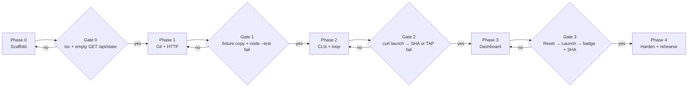
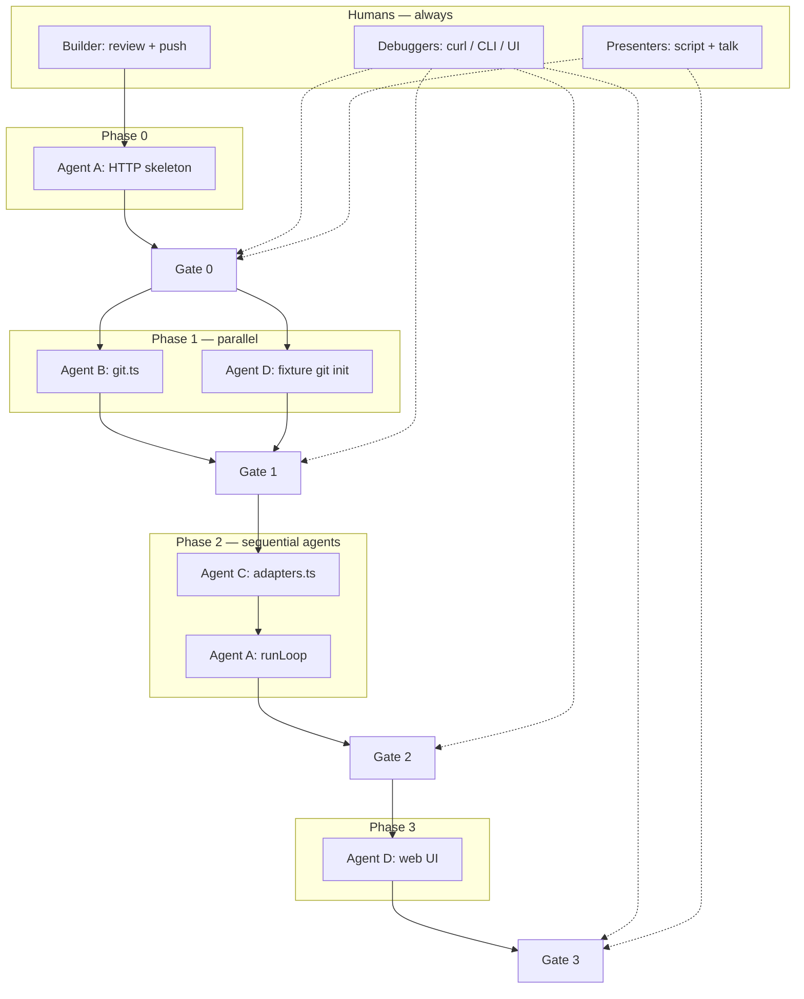
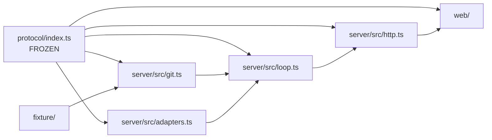

# LoopSync — general build plan

One person **builds** (Cursor + agents + git push). Everyone else **debugs** live runs or **plans the presentation**. The four playbooks in [`impl/`](impl/) are **agent tracks**, not four human coding streams.

Frozen contracts stay in [`../protocol/index.ts`](../protocol/index.ts). Do not rename JSON keys mid-day.

---

## Team roles (humans)

| Role | Count | Job |
|---|---|---|
| **Builder** | 1 | Launch agents, review diffs, merge, `git push`, keep `main` green enough to demo |
| **Debugger** | 1–2 | Run Codex/Claude on the laptop, curl `:4055`, file bugs as *exact* failing commands + logs |
| **Presenter** | 1–2 | Demo script, slides/talk track, backup video, “what we built” one-pager |

The Builder is the only one who commits application code. Debuggers may patch one-liners if the Builder is in an agent turn — still push through the same `main` branch, no long-lived forks.

---

## Phases and gates

Each phase has a **gate**. Do not start the next phase’s agents until the gate is true. Presentation work runs **in parallel with every phase**.



### Phase 0 — Scaffold (Builder + Agent A only)

**Agents:** one, playbook [`impl/person-1-orchestrator.md`](impl/person-1-orchestrator.md) **steps 1–4 only** (Express, store, HTTP, **no** `runLoop` yet).

**Builder:** create `package.json` / `tsconfig` if the agent does not; `git push`.

**Debuggers:** `curl http://127.0.0.1:4055/api/state` — expect `http-get-state-empty.json` shape. POST launch 201, POST gemini 400.

**Presenters:** outline 60-second demo; screenshot empty UI later.

**Gate 0:** `npx tsc --noEmit` passes (or server starts). `GET /api/state` returns both slots idle. Do not spawn Claude/Codex yet.

---

### Phase 1 — Git runtime + fixture (Agent B ∥ Agent D-fixture)

**Agents in parallel:**

- **Agent B** — [`impl/person-2-git-runtime.md`](impl/person-2-git-runtime.md) → `server/src/git.ts`
- **Agent D (fixture only)** — [`impl/person-4-dashboard.md`](impl/person-4-dashboard.md) **step 1** → `git init` failing `fixture/` if needed

**Builder:** merge both; do not start the loop.

**Debuggers:** `cd fixture && node --test` still **fails** `4 !== 5`. Isolated `createWorkspace` + `runTests` fail, manual one-line fix, `runTests` pass, `commitIfDirty` returns a SHA.

**Presenters:** write the story: “tests are the boss, not the model.”

**Gate 1:** GitRuntime works with **no** coding CLI. Fixture HEAD is the buggy tree.

---

### Phase 2 — CLI adapters + loop (Agent C, then Agent A loop)

Do **not** run Agent C and the loop agent before Gate 1.

**First:** **Agent C** — [`impl/person-3-cli-adapters.md`](impl/person-3-cli-adapters.md) → `server/src/adapters.ts`  
**Then:** **Agent A (loop)** — [`impl/person-1-orchestrator.md`](impl/person-1-orchestrator.md) **steps 5–7** — wire `runLoop` to real git + adapters.

Codex and Claude may run **sequentially** on the demo laptop (one job). Do not demo Gemini.

**Builder:** watch agent diffs for `shell: true`, `read-only` sandbox, or FakeAdapter — reject those.

**Debuggers (critical):** on the **demo laptop**, POST `protocol/examples/http-post-tasks.request.json`, poll `/api/state` until `succeeded` + `commitSha` or `failed` + TAP. Paste full curl + snapshot into chat if it breaks.

**Presenters:** time a Codex run so the talk does not stall; have a second launch on Claude as encore.

**Gate 2 (hour-3 equivalent):** terminal-only: Reset-equivalent `POST /api/reset` → Launch → real CLI → tests → SHA **or** honest failed TAP. **No dashboard required.** If this fails, do not build UI features.

---

### Phase 3 — Dashboard (Agent D UI)

**Agents:** **Agent D (UI)** — [`impl/person-4-dashboard.md`](impl/person-4-dashboard.md) steps 2–6 → `web/`. Builder serves it from Express `:4055`.

**Debuggers:** full click path on desktop and a phone-width window. Log fetch errors.

**Presenters:** sit next to the Builder and write the spoken script against the **real** UI, not mock JSON.

**Gate 3:** Reset → Launch → live logs → Succeeded + diff + SHA (or Failed + error). Repeat twice.

---

### Phase 4 — Harden and rehearse (humans; tiny agent patches only)

- Timeouts, Cancel, Reset leftover folders
- One more Codex run, one Claude run
- Presenter dry-run **three times**
- Builder freezes `main` except crash fixes

**Gate 4:** three rehearsals without a hung CLI. Kill button works.

---

## Parallel graph (agents vs humans)

Who can run at the same time, and what must wait.



Dependency of **code modules** (what each agent is allowed to write):



**Rule:** agents may write only their box. The Builder merges. `protocol/` is read-only.

---

## How the Builder launches agents

1. One playbook per agent: attach `docs/impl/person-N-*.md` + `protocol/index.ts` + `protocol/examples/`.
2. Prompt: “Follow the playbook in order. Stop at the listed verify command. Do not edit protocol. Do not add Gemini or a fake adapter.”
3. Max **two** code agents at once (Phase 1 only). Phase 2 is one adapter agent, then one loop agent.
4. After each agent: Builder runs that phase’s **debugger** commands, then `git push`.
5. If two agents touch the same file, stop and serialize. They should not: playbooks isolate files.

---

## What non-builders do instead of coding

**Debuggers** keep a running pad:

```
command:
expected:
actual:
phase:
```

**Presenters** keep:

- 15-second problem statement
- 60-second click script ([TEAM_PLAN demo](TEAM_PLAN.md#demo-script-what-judges-see))
- Backup: terminal `curl` + `node --test` if the UI dies
- Honest line: Gemini CLI is dead for individual accounts; Codex + Claude are the live robots

---

## What we are not doing

- Four humans each implementing a playbook
- Four long-lived git branches
- Starting the dashboard before Gate 2
- FakeAdapter on stage
- Gemini
