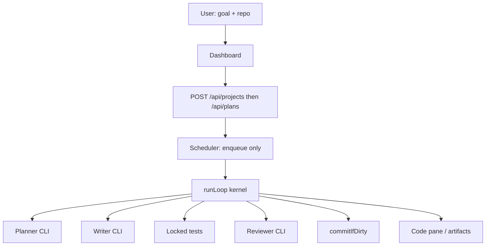

# LoopSync — full orchestration platform

Sequel to [`PHASE_C.md`](PHASE_C.md). Kernel (one `runLoop`, locked oracle, writer ≠ reviewer, Node starts every spawn) **stays**. This file is how we grow from “one homework job” to “plan and run a whole project.”

Do not start this by rewriting HTTP, git, or CLI argv. Wrap the kernel.

---

## What we have

A **step engine**:

```
goal fragment
  → optional planner process
  → writer process
  → oracle lock
  → node --test (only SHA veto)
  → optional adversarial reviewer (new process)
  → git commit of production files
```

That is the right inner mechanism. It is not a product for entire projects. Today every Launch still copies `fixture/`, and the oracle is always `parse.test.js` (`4 !== 5`). A user who asks for `integer_sqrt` still gets judged by `parseIndex`. That is the first thing to kill.

---

## What Manus is (steal the shape, not the zoo)

[Manus](https://www.manus.im) is not a chat box. A user states a **goal**. A central executor writes a **visible task list**, then hands items to specialized workers inside an **isolated computer** (filesystem, terminal, sometimes a browser). The user watches artifacts appear (files, reports, sites), not a token dump. Wide Research is the scale trick: one item per agent, fresh context, then a synthesizer.

Steal these four ideas:

| Manus | LoopSync equivalent |
|---|---|
| Goal, not a single prompt against a toy file | **Project**: repo path + goal + oracle that belongs to *this* job |
| Orchestrator writes a live task list | **Plan object** the human can edit before workers run |
| Sub-agents in a sandbox | Already: copy-on-write workspace + Claude/Codex processes |
| Finished files, not chat | **Code pane + artifact index** (started); make it the product |

Do **not** steal in the next phases: a proprietary cloud VM fleet, a browser operator, email/Slack inboxes, “hundreds of agents,” or a second orchestrator that bypasses `runLoop`. LoopSync’s edge vs Manus is local CLIs, a **tamper-proof oracle**, and split-context review (the [Bun-in-Rust](https://bun.com/blog/bun-in-rust) lesson). Keep that.

---

## North star

A user opens LoopSync, points it at a folder (or an empty project), types a goal, picks who plans / writes / reviews, and optionally writes or generates **tests for that goal**. LoopSync:

1. Produces a plan as a list of **work items** (not a paragraph).
2. Lets the human edit or freeze the plan.
3. Runs each item through the existing `runLoop` kernel (or a thin scheduler that only **enqueues** `runLoop`).
4. Shows files and a pass/fail oracle for *that* item.
5. Stops on caps, cancel, or a red oracle. Never lets a model `git commit`.

One Node process on `:4055` remains the only process that spawns CLIs and git.

```text
Project
  goal
  workspace (copy of a repo, or a blank tree)
  oracle (test command + locked paths)
  plan[]          ← editable
    WorkItem
      runLoop()   ← today’s kernel, reused
```



---

## Hard rules (do not drop)

1. **Node owns spawn.** A CLI must not start another LoopSync loop. Scheduler may enqueue; it may not copy `git.ts`.
2. **Oracle is per project**, not global `parse.test.js`. Models cannot edit locked test paths.
3. **Writer and reviewer are different processes.** Same binary allowed; same context window not allowed.
4. **Tests veto the SHA.** Review cannot approve red tests.
5. **No Gemini, no FakeAdapter.** Claude and Codex stay the workers.
6. **Caps before every `adapter.run`.** Ledger survives Reset of the live UI.
7. Additive protocol fields only until a versioned v2; then a shout, not a silent rename.

---

## Phases

Each phase has a gate. Do not start the next until the gate is true. UI polish can ride along.

### Phase D — A project is not the fixture

**Problem:** Launch always clones `fixture/` and always runs `parse.test.js`.

**Build:**

- `Project`: `{ id, root, goal, testCommand, oraclePaths[], defaultAgents }`
- Copy `root` (user path or uploaded zip) into `/tmp/loopsync-workspaces/<projectId>/<itemId>` — same isolation as today.
- `testCommand` default `node --test`; allow `python -m pytest` etc. Still `shell: false` (argv array).
- Oracle lock uses `oraclePaths` from the project, not a hardcoded `parse.test.js`.
- Homework `fixture/` remains a **demo project**, not the only project.

**UI:** “Open folder” / paste a path. Goal box. Oracle command shown as a locked chip. Code pane already exists.

**Gate D:** User launches “add `integer_sqrt` in `sqrt.py`” against a tiny Python tree whose tests assert `integer_sqrt(9) == 3`. SHA contains `sqrt.py`. `parse.js` is never touched. Editing the pytest file still yields `ORACLE_TAMPERED`.

### Phase E — The plan is an object

**Problem:** Planner output is prose in a timeline card. The writer still gets one blob.

**Build:**

- Planner must emit a machine-readable plan (JSON in `protocol/examples/plan.v1.json`): ordered `items[]` with `title`, `files[]`, `doneWhen`.
- Human sees a checklist. Can delete, reorder, or freeze an item before Run.
- Scheduler runs **one item at a time** through `runLoop` (demo laptop: sequential).
- Item prompt = original goal + this item + list of already-shipped files.

**UI:** Manus-style task list in the activity column. Current item highlighted. Code pane follows the active item.

**Gate E:** A two-item plan (write `sqrt.py`, then write `test_sqrt.py` **unlocked** as production — wait: tests that *are* the oracle stay locked; extra tests the writer owns are production). Simpler gate: two items, both production, one oracle file pre-existing. Both items succeed; the list shows item 1 done before item 2 starts.

Do **not** let an LLM rewrite the oracle in this phase.

### Phase F — Queue, ledger, resume

**Problem:** Reset wipes RAM. One in-flight job. No way to continue a project tomorrow.

**Build:**

- Jobs file or SQLite (Phase C ledger already JSONL — promote it).
- `GET /api/projects/:id` reconstructs plan + item statuses from disk after restart.
- Queue: `pending → running → blocked → done | failed`.
- Resume an item with `retryPrompt` + last oracle output; still a **new** CLI process.
- Finder (Phase C “later”): a `jobs.json` in the project, not GitHub, not an LLM dispatcher.

**Gate F:** Kill the server mid-item, restart, UI shows the same project and remaining items. Cancel still aborts the live spawn.

### Phase G — Parallel shards (optional, after F)

**Problem:** One laptop, one Codex. Manus Wide Research needs many contexts.

**Build only if the laptop (or a worker pool) can run two writers without disk fights:**

- Shard independent plan items into **separate workspace copies**, then merge via git.
- One reviewer per shard, sequential on a single machine if needed.
- Never parallel writer + reviewer on the **same** worktree (Phase C).

**Gate G:** Two independent files in two worktrees, both green, merged to the project branch without clobbering.

### Explicitly later / maybe never

- Browser operator (Manus differentiator; not our kernel)
- Recursive `runLoop` spawned from a CLI
- LLM that authors the **oracle** (dangerous; if ever, human must freeze the file first)
- Slack / email as the control plane
- Token-perfect telemetry (nice; ledger timestamps first)

---

## Data model (additive)

```ts
Project {
  id, title, goal
  sourceDir          // original; never commit here
  testCommand: string[]
  oraclePaths: string[]
  plannerProvider?, writerProvider, reviewerProvider?
}

Plan {
  projectId
  items: PlanItem[]   // human-editable
}

PlanItem {
  id, title, prompt, files[]
  status: pending | running | succeeded | failed
  taskId?             // existing TaskState when running
}
```

`LaunchTaskBody` stays valid for a **single item** (today’s curl). Projects wrap many launches.

---

## UI (keep the three columns)

| Column | Now | Target |
|---|---|---|
| Left | New run | **Project**: folder, goal, agents, oracle chip |
| Center | Activity cards | **Plan checklist** + per-item activity (no CLI chrome) |
| Right | Code pane | **Artifacts**: files for the selected item; click through history |

Technical details stay collapsed. Do not put `sed` output or Codex banners in cards.

---

## Suggested build order for the next working slice

If we only get one more slice after this doc, it is **Phase D Gate D**:

1. Protocol: `Project`, `testCommand`, `oraclePaths` (additive).
2. `git.ts`: copy `sourceDir` instead of hardcoded `fixture/`; oracle lock uses `oraclePaths`.
3. HTTP: `POST /api/projects` then `POST /api/tasks` with `projectId`.
4. UI: folder + goal; Code pane already shows new files.
5. Ship a second demo tree `examples/sqrt/` with pytest (or `node --test` on a `sqrt.js`) so we do not pretend `parseIndex` is every job.

That unblocks “orchestrate a project.” Phases E–F are how it becomes Manus-shaped without throwing away the kernel.

---

## Verify mindset

For every phase, the debugger still files:

```
command:
expected:
actual:
phase:
```

If Launch still fixes `parse.js` when the goal was Python sqrt, Phase D is not done.
