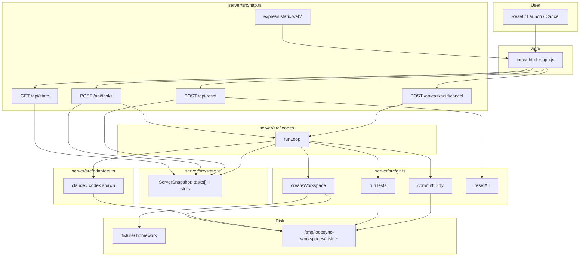

# LoopSync — workflow (user → API → orchestration)

One Node process on **`:4055`**. The browser (or curl) never talks to git or to Claude/Codex. It only hits four JSON endpoints. The orchestrator owns workspaces, tests, and commits.

Frozen field names live in [`protocol/index.ts`](../protocol/index.ts). Example payloads live in [`protocol/examples/`](../protocol/examples/).

There is **no WebSocket**. The UI polls `GET /api/state` every **300ms**.

---

## Files in the path

| Layer | File | Role |
|---|---|---|
| UI | `web/index.html`, `web/app.js` | Launch / Cancel / Reset; poll and paint the latest task |
| Boot | `server/src/index.ts` | Compose store + git + adapters, listen `0.0.0.0:4055` |
| HTTP | `server/src/http.ts` | The four routes + static `web/` |
| State | `server/src/state.ts` | In-memory `tasks[]` + provider slots |
| Loop | `server/src/loop.ts` | `runLoop`: workspace → CLI → tests → commit or retry |
| Git | `server/src/git.ts` | Copy fixture, `node --test`, diff, commit (only committer) |
| CLIs | `server/src/adapters.ts` | Spawn `claude` or `codex` in the workspace |
| Homework | `fixture/` | Buggy `parse.js`; tests must fail `4 !== 5` until a CLI fixes the copy |
| Contract | `protocol/index.ts` | Types, port, poll interval, CLI argv, `retryPrompt()` |

Workspaces are always `/tmp/loopsync-workspaces/<taskId>`, never the original `fixture/` tree.

---

## General workflow

1. Open `http://127.0.0.1:4055` — Express serves `web/` as static files.
2. The page polls **`GET /api/state` every 300ms** and paints the latest task (status, logs, TAP error, diff, SHA).
3. **Launch** posts title, prompt, provider (`claude` \| `codex`), optional `maxIterations` (default **2**).
4. HTTP returns **201 `{ taskId }` immediately**, then `runLoop` runs in the background.
5. The loop copies `fixture/` into `/tmp/loopsync-workspaces/<taskId>`, runs the CLI in that copy, then `node --test`. **Tests decide pass/fail, not the model.**
6. Fail → status `retrying`, TAP stuffed into the next prompt, **new** CLI process. Pass → **only then** `git commit` in the copy.
7. Reset wipes RAM + `/tmp` workspaces, never `fixture/`.



---

## API calls

Base URL: `http://127.0.0.1:4055`. `Content-Type: application/json`.

| User action | HTTP | Success | Error |
|---|---|---|---|
| Page load / poll | `GET /api/state` | `ServerSnapshot` | UI: cannot reach `:4055` |
| Launch | `POST /api/tasks` | **201** `{ "taskId" }` | 400 bad / gemini; 409 slot busy |
| Cancel | `POST /api/tasks/:id/cancel` | `{ "ok": true }` | 404 unknown id |
| Reset | `POST /api/reset` | `{ "ok": true }` | — |

### `GET /api/state`

Returns the whole server snapshot: every task plus two provider slots (`claude`, `codex`), each with `isBusy`.

Empty shape (`protocol/examples/http-get-state-empty.json`):

```json
{
  "tasks": [],
  "slots": [
    { "provider": "claude", "isBusy": false },
    { "provider": "codex", "isBusy": false }
  ]
}
```

The UI does not subscribe to events. It re-fetches this every 300ms and renders `tasks.at(-1)`: queued / running / retrying (`lastError`) / succeeded (`commitSha` + `diff`) / failed (`lastError`, no SHA).

### `POST /api/tasks`

Starts a job. Body (`protocol/examples/http-post-tasks.request.json`):

```json
{
  "title": "Fix Off-By-One Index in Array Parser",
  "prompt": "The test in parse.test.js fails. Make parseIndex return the correct value so the test passes. Do not change the test. Do not ask questions. Do not run git commit.",
  "provider": "codex",
  "maxIterations": 2
}
```

What HTTP does:

1. Reject non-objects, empty title/prompt, non-integer `maxIterations` &lt; 1, or any provider other than `claude` \| `codex` → **400** `BAD_REQUEST` (Gemini is explicitly 400).
2. If that provider’s slot `isBusy` → **409** `SLOT_BUSY` (one job per provider).
3. `store.addTask` — status `queued`, `maxIterations` default **2**, empty `workspaceDir` / `logs`.
4. Respond **201** `{ "taskId" }` **without waiting** for the CLI.
5. Start `runLoop` in the background (orchestration below).

### `POST /api/tasks/:id/cancel`

If the id is unknown → **404** `TASK_NOT_FOUND`. Otherwise **200** `{ "ok": true }` and abort that task’s `AbortController`. The loop sees the signal, marks the task failed/cancelled, and clears the busy slot. The CLI process is killed (120s timeout is the other kill path).

### `POST /api/reset`

Demo “start over”:

1. Abort every in-flight task.
2. `git.resetAll()` — delete `/tmp/loopsync-workspaces` only, never `fixture/`.
3. `store.clear()` — empty `tasks[]`, both slots idle.

Returns **200** `{ "ok": true }`.

---

## Orchestration (`runLoop`)

HTTP is only the front door. After the 201, Track A’s loop is the only integrator. Git and adapters plug into it; they do not call each other.

```
createWorkspace
for attempt 1..maxIterations:
  status = running (or retrying if attempt > 1)
  adapter.run(dir, prompt or prompt+lastError, onLog, signal)
  tests = runTests(dir)
  if tests.passed:
    commitIfDirty
    status = succeeded
    stop
  else:
    lastError = tests.output
    status = retrying
status = failed
```

There is **no** CLI “resume.” Attempt 2 is a **new process**. Coding agents must not `git commit`; `git.ts` is the only committer.

```mermaid
sequenceDiagram
  actor User
  participant UI as web/app.js
  participant HTTP as http.ts
  participant Store as state.ts
  participant Loop as loop.ts
  participant Git as git.ts
  participant Adp as adapters.ts
  participant CLI as claude/codex
  participant Tests as node --test

  User->>UI: Launch Codex
  UI->>HTTP: POST /api/tasks
  HTTP->>Store: addTask queued
  HTTP-->>UI: 201 taskId
  HTTP->>Loop: runLoop async
  Loop->>Store: setBusy true, status running
  Loop->>Git: createWorkspace taskId
  Git-->>Loop: dir in /tmp/...
  Loop->>Adp: run dir, prompt, onLog, signal
  Adp->>CLI: spawn cwd=dir
  CLI-->>Adp: stdout/stderr
  Adp-->>Loop: exitCode of process
  Loop->>Git: runTests dir
  Git->>Tests: spawn
  alt tests passed
    Loop->>Git: commitIfDirty
    Git-->>Loop: sha + diff
    Loop->>Store: succeeded, commitSha, diff, busy false
  else tests failed and attempts left
    Loop->>Store: retrying, lastError = TAP
    Loop->>Adp: new process, retryPrompt + TAP
  else out of attempts
    Loop->>Store: failed, lastError = TAP, busy false
  end

  loop every 300ms
    UI->>HTTP: GET /api/state
    HTTP->>Store: getSnapshot
    HTTP-->>UI: tasks + slots
    UI-->>User: badge, logs, diff, SHA
  end
```

### What each step does

**1. Workspace.** `createWorkspace(taskId)` copies `fixture/` to `/tmp/loopsync-workspaces/<taskId>`, checks out branch `loopsync/<taskId>`, and requires `parse.js` + `parse.test.js`. The CLI can wreck this copy. Original homework stays failing.

**2. Busy + status.** Slot for that provider becomes `isBusy: true` so a second Launch of the same provider 409s. `currentIteration` ticks. Attempt 1 → `running`; later attempts → `retrying`. Orchestrator log lines are prefixed `[loop]`, `[tests]`, `[git]`.

**3. CLI run.** `adapters[provider].run(workspaceDir, prompt, onLog, signal)` spawns the proven argv (`claude -p …` or `codex exec --sandbox workspace-write …`) with `cwd` = the copy. Stdout/stderr stream into `task.logs` via `onLog`. A **0 exit code means the process exited**, not that homework is fixed. Timeout 120s or Cancel aborts the process.

**4. Tests are the judge.** `git.runTests(dir)` is `node --test` in the copy. `passed === (exitCode === 0)`. Full TAP is `output`. Stock fixture fails `4 !== 5`. The loop does not parse TAP beyond that.

**5a. Pass.** `commitIfDirty` stages, commits if there are changes (never `--amend`, never in original `fixture/`), returns `{ sha, diff }`. Task → `succeeded` with `commitSha` + `diff`. Slot idle. Loop returns.

**5b. Fail, attempts left.** `lastError` = the TAP string. Next prompt is `retryPrompt(originalPrompt, testOutput)` from `protocol/index.ts`: original task + “tests failed, fix the code not the test” + `TEST OUTPUT:`. New spawn, not resume.

**5c. Fail, no attempts left.** Task → `failed` with `lastError`, no SHA. Slot idle.

Cancel/Reset can fire in the middle: if `AbortSignal` is aborted, the loop stops, marks the task done, and clears busy.

---

## Scaffold vs this workflow

This file describes the **full** path. What is wired on `main` today:

| Piece | Status |
|---|---|
| `GET/POST` routes in `http.ts` | Built. Launch **queues only** — it does not start `runLoop` |
| `state.ts` | Built. `setBusy` is unused until the loop exists |
| `git.ts` | Built as a library; `index.ts` still injects a stub |
| `loop.ts`, `adapters.ts`, `web/` | Not built yet |

Until those land, curl can 201 a `queued` task that never leaves `queued`. Phases and gates: [`BUILD_PLAN.md`](BUILD_PLAN.md). After Gate 2, wrap this kernel with independent writer / tests / review / git steps: [`PHASE_C.md`](PHASE_C.md).
